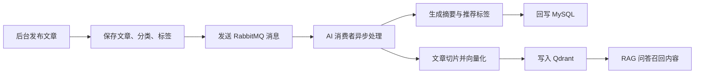
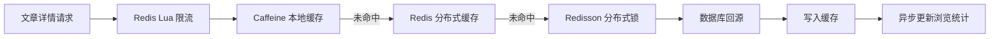

# W-P Blog

<p align="center">
  <a href="https://w-love-p.top">
    
  </a>
</p>

<p align="center">
  一个从个人博客演进而来的内容平台，覆盖前台展示、后台运营、后端服务、AI 问答、搜索检索与工程化部署。
</p>

<p align="center">
  
  
  
  
  
  
  
</p>

## 项目简介

`W-P Blog` 最初是一个基于 Spring Boot + Vue3 的前后端分离博客，现在已经逐步升级为一个更完整的内容平台项目。

它不只包含文章、评论、标签、分类、相册、友链、留言、聊天和后台权限等博客基础能力，也围绕热点访问、缓存优化、异步处理、AI 摘要、RAG 问答、向量检索、可观测性和 Docker 部署做了系统化增强。

更准确的项目定位是：

> 基于 Spring Boot 3 + Vue3 的内容平台与 AI 增强知识检索系统。

## 在线地址

| 名称 | 地址 |
| --- | --- |
| 博客前台 | [w-love-p.top](https://www.ttkwsd.top) |
| 接口文档 | [doc.html](http://w-love-p.top:8080/doc.html) |
| GitHub | [w-p-lover/w-p_blog](https://github.com/w-p-lover/w-p_blog) |

测试账号：

```text
账号：test@qq.com
密码：123456
```

后台默认账号：

```text
账号：admin@qq.com
密码：123456
```

## 仓库结构

```text
blog
├─ blog-springboot/        # Spring Boot 后端服务
├─ shoka-blog/             # 博客前台，面向访客与内容阅读
├─ shoka-admin/            # 后台管理端，面向内容运营与系统管理
├─ deploy/                 # 部署、ES 映射等辅助文件
├─ docs/                   # 项目文档与阶段计划
└─ README.md               # 当前总览文档
```

重点文档：

- [后端专项 README](blog-springboot/README.md)
- [安全配置说明](blog-springboot/docs/secure-config-quickstart.md)
- [Docker Compose 部署](blog-springboot/docs/deployment-compose.md)
- [就业项目分析](blog-springboot/docs/project-employment-analysis.md)

## 核心能力

| 方向 | 能力 |
| --- | --- |
| 前台展示 | 首页、文章详情、分类标签、归档、相册、留言、友链、说说、聊天室、音乐播放器 |
| 后台管理 | 文章管理、分类标签、用户角色、菜单权限、评论审核、文件管理、日志管理、任务调度 |
| 内容检索 | MySQL/Elasticsearch 搜索策略切换、关键词检索、文章聚合与排序 |
| AI 增强 | 文章摘要、推荐标签、文章向量化、RAG 问答、SSE 写作助手 |
| 高并发优化 | Redis 缓存、Caffeine + Redis 多级缓存、Redis Lua 限流、Redisson 分布式锁 |
| 异步处理 | RabbitMQ 邮件通知、文章 AI 处理、死信队列、线程池异步任务 |
| 可观测性 | Actuator、Prometheus 指标、结构化 JSON 日志、OpenTelemetry 链路追踪 |
| 工程化部署 | 多环境配置、`.env` 注入、Dockerfile、Docker Compose、外部私有配置 |

## 技术栈

### 后端

| 类型 | 技术 |
| --- | --- |
| 基础框架 | Spring Boot 3.2.5, Java 17, Maven |
| 数据访问 | MyBatis-Plus, MySQL 8, Druid |
| 缓存与锁 | Redis, Caffeine, Redisson, Lua |
| 消息与任务 | RabbitMQ, Quartz, ThreadPoolTaskExecutor |
| 搜索与 AI | Elasticsearch 7.17, Spring AI, Qdrant, DeepSeek/OpenAI-compatible API, DashScope |
| 权限安全 | Sa-Token, CORS, 多环境敏感配置外置 |
| 监控日志 | Actuator, Micrometer, Prometheus, OpenTelemetry, Logstash Logback Encoder |

### 前端

| 类型 | 技术 |
| --- | --- |
| 基础框架 | Vue 3, TypeScript, Vite |
| 状态与路由 | Pinia, Vue Router |
| UI 组件 | Element Plus, Naive UI |
| 网络请求 | Axios |
| 编辑与展示 | Markdown 编辑器, Quill, PrismJS, ViewerJS |
| 可视化与互动 | ECharts, Swiper, WebSocket/STOMP, Live2D |

## 核心链路

### 文章发布后的 AI 处理



### 热点文章访问优化



## 快速开始

### 后端启动

进入后端目录：

```powershell
cd blog-springboot
```

复制环境变量模板：

```powershell
Copy-Item .env.example .env
```

修改 `.env` 中的数据库、Redis、RabbitMQ、AI Key 等配置后启动：

```powershell
mvn spring-boot:run
```

后端默认地址：

```text
http://localhost:8080
```

### 前台启动

```powershell
cd shoka-blog
npm install
npm run dev
```

### 后台启动

```powershell
cd shoka-admin
npm install
npm run dev
```

### Docker Compose 启动后端依赖

后端目录下提供了完整 Compose 编排：

```powershell
cd blog-springboot
docker compose up -d --build
```

会拉起 Spring Boot、MySQL、Redis、RabbitMQ、Elasticsearch 和 Qdrant。

## 项目亮点

- 从 Spring Boot 2 风格项目升级到 Spring Boot 3 + Java 17，并处理依赖兼容、API 文档、ES 客户端和 Sa-Token 适配。
- 使用 RabbitMQ 解耦文章发布与 AI 处理，支持文章摘要、推荐标签、向量入库和历史文章重建。
- 基于 Spring AI + Qdrant 实现站内文章 RAG 问答，并提供 SSE 流式写作助手。
- 基于 Caffeine + Redis + Redisson 构建多级缓存体系，降低热点文章详情接口的数据库压力。
- 使用 Redis Lua 和注解式 AOP 实现接口限流，保护文章详情、AI 写作等高频接口。
- 使用 `.env`、多 profile 和外部私有配置管理敏感信息，提升项目公开展示与部署安全性。
- 接入 Actuator、Prometheus、结构化日志和链路追踪，让项目从功能实现走向可观测工程。

## 当前迭代方向

| 阶段 | 目标 | 状态 |
| --- | --- | --- |
| Phase 1 | Spring Boot 3 / Java 17 升级，可观测性接入 | 已完成 |
| Phase 2 | 多级缓存、限流、分布式锁、热点文章优化 | 已完成第一版 |
| Phase 3 | AI 摘要、RAG 问答、SSE 写作助手、向量库接入 | 已完成核心链路 |
| Phase 4 | README、测试隔离、CI 质量门禁、公开展示优化 | 进行中 |

## 适合面试展开的内容

- 为什么把“博客系统”重新定位成“内容平台 + AI 知识检索系统”。
- 文章发布后如何通过 MQ 异步生成摘要、标签并写入向量库。
- 多级缓存如何处理缓存穿透、击穿、雪崩和多实例失效。
- RAG 问答如何从文章切片、向量召回到生成带来源的回答。
- Spring Boot 3 升级过程中遇到的依赖兼容和工程化问题。
- 如何把个人项目整理成可部署、可复现、可观测的就业作品。

## 维护约定

- 不提交 `.env`、真实密钥、私有配置和服务器凭据。
- 不提交 `target/`、日志、Python 缓存和爬虫下载产物。
- 大体积图片、小说文本、爬虫结果建议放对象存储或运行时目录，不进入 Git 历史。
- 面向公开展示时，优先保留代码、文档、示例配置和必要截图。

## 后续计划

- 补充更完整的 README 截图、架构图和监控面板图。
- 为核心链路补齐 Testcontainers 测试隔离。
- 将 CI 从跳过测试改为执行关键单测和冒烟测试。
- 优化首页和文章列表分页，减少全量查询与内存分页压力。
- 完善 AI 调用监控、token 成本统计、Prompt 版本管理和召回质量评估。
