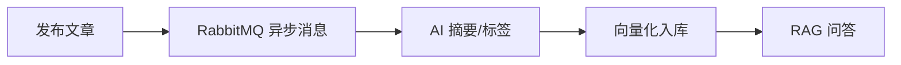
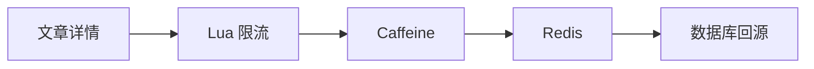

# W-P Blog

<p align="center">
  <a href="https://w-love-p.top">
    
  </a>
</p>

<p align="center">
  <strong>Spring Boot 3 + Vue3 内容平台</strong><br/>
  博客展示、后台运营、AI 问答、搜索检索、缓存优化与容器化部署。
</p>

<p align="center">
  
  
  
  
  
  
</p>

## Overview

`W-P Blog` 是一个从个人博客升级而来的内容平台项目，由后端服务、博客前台和后台管理端组成。

它的核心不只是文章 CRUD，而是围绕内容生产、热点访问、搜索检索、AI 增强和工程化部署做了一轮系统升级。

## Links

| 名称 | 地址 |
| --- | --- |
| 博客前台 | [w-love-p.top](https://www.ttkwsd.top) |
| 接口文档 | [doc.html](http://w-love-p.top:8080/doc.html) |
| GitHub | [w-p-lover/w-p_blog](https://github.com/w-p-lover/w-p_blog) |
| 后端说明 | [blog-springboot/README.md](blog-springboot/README.md) |

测试账号：`test@qq.com / 123456`

后台账号：`admin@qq.com / 123456`

## Modules

```text
blog
├─ blog-springboot/   # Spring Boot 后端，核心业务与 AI 能力
├─ shoka-blog/        # 博客前台，文章阅读与互动展示
├─ shoka-admin/       # 后台管理，内容运营与系统管理
└─ deploy/            # 部署与辅助配置
```

## Highlights

| 方向 | 内容 |
| --- | --- |
| 内容平台 | 文章、分类、标签、评论、留言、友链、相册、说说、聊天室 |
| 后台运营 | 用户、角色、菜单、权限、日志、任务调度、文件管理 |
| AI 增强 | 文章摘要、推荐标签、向量入库、RAG 问答、SSE 写作助手 |
| 性能优化 | Caffeine + Redis 多级缓存、Redis Lua 限流、Redisson 分布式锁 |
| 工程化 | Java 17、Spring Boot 3、多环境配置、Docker Compose、Prometheus 指标 |

## Stack

| 端 | 技术 |
| --- | --- |
| 后端 | Spring Boot 3, Java 17, MyBatis-Plus, MySQL, Redis, RabbitMQ, Elasticsearch |
| AI | Spring AI, Qdrant, DeepSeek/OpenAI-compatible API, DashScope |
| 前端 | Vue 3, TypeScript, Vite, Pinia, Vue Router, Element Plus, Naive UI |
| 运维 | Docker, Docker Compose, Actuator, Micrometer, Prometheus, OpenTelemetry |

## Core Flow





## Quick Start

后端：

```powershell
cd blog-springboot
Copy-Item .env.example .env
mvn spring-boot:run
```

前台：

```powershell
cd shoka-blog
npm install
npm run dev
```

后台：

```powershell
cd shoka-admin
npm install
npm run dev
```

完整后端依赖：

```powershell
cd blog-springboot
docker compose up -d --build
```

## Docs

- [后端专项说明](blog-springboot/README.md)
- [安全配置](blog-springboot/docs/secure-config-quickstart.md)
- [Docker Compose 部署](blog-springboot/docs/deployment-compose.md)
- [就业项目分析](blog-springboot/docs/project-employment-analysis.md)

## Roadmap

- 补齐 Testcontainers 测试隔离。
- 将 CI 从跳过测试调整为执行关键测试。
- 优化文章列表分页与热点缓存统计。
- 完善 AI 调用监控、Prompt 管理和 RAG 召回评估。
