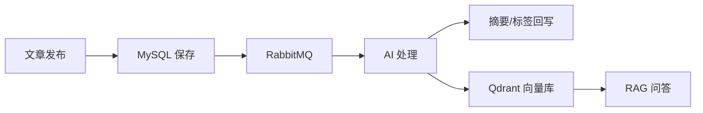
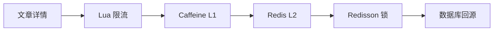

# Blog SpringBoot


`blog-springboot` 是 W-P Blog 的后端服务。项目已从传统博客后端升级为内容平台后端，重点放在文章内容、热点访问、AI 增强、搜索检索和工程化部署。

## Position

> 基于 Spring Boot 3 + Java 17 的内容平台与 AI 增强知识检索系统。

适合重点展示：

- 文章发布后的异步 AI 处理链路。
- Caffeine + Redis 多级缓存与热点文章优化。
- Redis Lua 限流、Redisson 分布式锁、RabbitMQ 死信队列。
- Spring AI + Qdrant 的 RAG 问答和 SSE 写作助手。
- 多环境配置、Docker Compose、Prometheus 指标和结构化日志。

## Architecture





## Features

| 模块 | 能力 |
| --- | --- |
| 内容 | 文章、分类、标签、归档、推荐、置顶 |
| 互动 | 评论、留言、点赞、访问记录、WebSocket 聊天 |
| 后台 | 用户、角色、菜单、权限、日志、任务调度 |
| 搜索 | MySQL/Elasticsearch 策略切换 |
| AI | 摘要、标签、向量入库、RAG 问答、SSE 写作 |
| 性能 | 多级缓存、限流、分布式锁、热点预热 |
| 工程 | Docker Compose、多环境配置、Actuator、Prometheus |

## Stack

| 方向 | 技术 |
| --- | --- |
| Framework | Spring Boot 3.2.5, Java 17, Maven |
| Database | MyBatis-Plus, MySQL 8, Druid |
| Cache | Redis, Caffeine, Redisson, Lua |
| Async | RabbitMQ, Quartz, ThreadPoolTaskExecutor |
| Search & AI | Elasticsearch 7.17, Spring AI, Qdrant, DashScope, DeepSeek |
| Security | Sa-Token, CORS, externalized secrets |
| Observability | Actuator, Micrometer, Prometheus, OpenTelemetry, JSON logs |

## Quick Start

准备环境变量：

```powershell
Copy-Item .env.example .env
Copy-Item config\application-private.example.yml config\application-private.yml
```

`.env.example` 负责本地环境变量，`config/application-private.example.yml` 负责本机私有覆盖；两者都只需要按自己的数据库、Redis、RabbitMQ 和第三方密钥改值即可。

启动后端：

```powershell
mvn spring-boot:run
```

常用地址：

| 地址 | 说明 |
| --- | --- |
| `http://localhost:8080` | API 服务 |
| `http://localhost:8080/doc.html` | Knife4j 文档 |
| `http://localhost:8080/actuator/health` | 健康检查 |
| `http://localhost:8080/actuator/prometheus` | Prometheus 指标 |

Docker Compose：

```powershell
docker compose up -d --build
```

会启动 Spring Boot、MySQL、Redis、RabbitMQ、Elasticsearch 和 Qdrant。

## API Examples

RAG 问答：

```powershell
curl -X POST "http://localhost:8080/api/ai/chat" `
  -H "Content-Type: application/json" `
  -d "{\"question\":\"Redis 缓存击穿怎么解决\"}"
```

SSE 写作助手：

```powershell
curl -N "http://localhost:8080/api/ai/write-assist?action=expand&content=缓存优化实践"
```

## Project Map

```text
src/main/java/com/ican
├─ annotation/    # 限流、日志、访问记录注解
├─ aspect/        # AOP 切面
├─ cache/         # 多级缓存
├─ config/        # Redis、RabbitMQ、WebSocket、AI 等配置
├─ consumer/      # MQ 消费者
├─ controller/    # REST API
├─ metrics/       # 自定义指标
├─ service/       # 业务逻辑
├─ strategy/      # 搜索、上传策略
└─ utils/         # 工具与 Python 脚本运行器
```

## Docs

- [文档目录](docs/README.md)
- [就业项目分析](docs/00-项目总览/01-就业项目分析.md)
- [后端深度开发路线](docs/00-项目总览/02-后端深度开发路线.md)
- [安全配置](docs/02-部署运维/01-安全配置快速开始.md)
- [Docker Compose 部署](docs/02-部署运维/02-Docker-Compose部署说明.md)
- [Nacos 示例](docs/02-部署运维/03-Nacos配置示例.md)

## Resume Line

基于 Spring Boot 3、Java 17、Redis、RabbitMQ、Elasticsearch 与 Spring AI 构建内容平台后端，实现文章管理、热点缓存、异步 AI 处理、向量检索、RAG 问答和 Docker Compose 部署。
