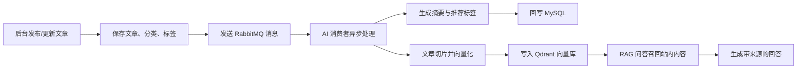
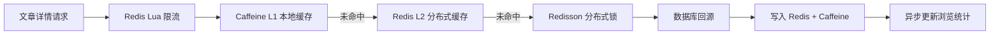

# Blog SpringBoot


一个从个人博客演进而来的内容平台后端项目。它不只覆盖文章、评论、标签、相册、权限和后台运营等常规能力，也围绕内容检索、热点访问、异步处理、AI 问答、可观测性和容器化部署做了系统化升级。

如果用一句话概括这个项目：

> 基于 Spring Boot 3 + Java 17 构建的内容平台与 AI 增强知识检索系统。

## 项目定位

这个项目最初是前后端分离博客系统，后续逐步升级为一个更接近真实业务的内容平台后端。当前核心目标不是堆更多小功能，而是把文章内容生产、搜索检索、热点访问优化、AI 处理和工程化部署串成一条完整链路。

适合展示的方向：

- Java 后端工程能力：接口设计、权限控制、缓存、消息队列、任务调度、搜索、文件上传。
- AI 应用落地能力：文章摘要、标签生成、向量化入库、RAG 问答、SSE 写作助手。
- 工程化能力：Spring Boot 3 升级、多环境配置、Docker Compose 部署、结构化日志、Prometheus 指标。
- 性能优化意识：热点文章缓存、Redis Lua 限流、Redisson 分布式锁、多级缓存失效广播。

## 核心链路

### 文章发布后的 AI 处理链路



这条链路让文章发布主流程不被 AI 调用阻塞，同时为后续站内知识问答、内容推荐和写作辅助留下扩展空间。

### 热点文章访问优化链路



多级缓存负责降低热点文章详情的数据库压力，限流和分布式锁用于保护高频访问场景下的稳定性。

## 功能概览

| 模块 | 能力 |
| --- | --- |
| 内容管理 | 文章发布、草稿、分类、标签、归档、推荐、置顶 |
| 互动体系 | 评论、留言、点赞、访问记录、WebSocket 聊天 |
| 后台管理 | 用户、角色、菜单、权限、操作日志、异常日志 |
| 搜索检索 | MySQL/Elasticsearch 策略切换、文章搜索、站内内容检索 |
| AI 能力 | 文章摘要、标签生成、向量入库、RAG 问答、SSE 写作助手 |
| 性能优化 | Caffeine + Redis 多级缓存、Redis Lua 限流、Redisson 分布式锁 |
| 异步任务 | RabbitMQ 消息消费、死信队列、Quartz 定时任务、异步线程池 |
| 文件与资源 | 本地/OSS 上传策略、相册、静态资源、Python 爬虫运行器 |
| 工程化 | 多环境配置、Dockerfile、Docker Compose、结构化日志、Actuator、Prometheus |

## 技术栈

| 方向 | 技术 |
| --- | --- |
| 基础框架 | Spring Boot 3.2.5, Java 17, Maven |
| 数据访问 | MyBatis-Plus, MySQL 8, Druid |
| 缓存与锁 | Redis, Caffeine, Redisson, Lua |
| 消息与任务 | RabbitMQ, Quartz, ThreadPoolTaskExecutor |
| 搜索与 AI | Elasticsearch 7.17, Spring AI, DeepSeek/OpenAI-compatible API, DashScope, Qdrant |
| 权限安全 | Sa-Token, CORS 配置, 多环境敏感配置外置 |
| 可观测性 | Spring Boot Actuator, Micrometer, Prometheus, OpenTelemetry, Logstash Logback Encoder |
| 部署 | Docker, Docker Compose, `.env`, 外部私有配置 |

## 快速开始

### 1. 准备环境

本地开发建议准备：

- JDK 17
- Maven 3.8+
- MySQL 8
- Redis 7
- RabbitMQ 3.x
- Elasticsearch 7.17
- Qdrant

也可以直接使用 Docker Compose 拉起完整依赖。

### 2. 准备配置

复制环境变量模板：

```powershell
Copy-Item .env.example .env
```

按本机情况修改 `.env`，至少确认这些变量：

```properties
SPRING_PROFILES_ACTIVE=dev
BLOG_DB_URL=jdbc:mysql://127.0.0.1:3306/blog?serverTimezone=Asia/Shanghai&useUnicode=true&characterEncoding=UTF-8
BLOG_DB_USERNAME=root
BLOG_DB_PASSWORD=replace-with-your-password
BLOG_REDIS_HOST=127.0.0.1
BLOG_REDIS_PASSWORD=
BLOG_RABBITMQ_HOST=127.0.0.1
BLOG_OPENAI_API_KEY=replace-with-your-key
BLOG_DASHSCOPE_API_KEY=replace-with-your-key
```

项目会自动读取 `.env` 和 `config/application-private.yml`：

```yaml
spring:
  config:
    import: optional:file:.env[.properties],optional:file:./config/application-private.yml
```

更完整的配置说明见 [secure-config-quickstart.md](docs/secure-config-quickstart.md)。

### 3. 本地启动

```powershell
mvn spring-boot:run
```

启动后常用入口：

| 地址 | 说明 |
| --- | --- |
| `http://localhost:8080` | 后端服务 |
| `http://localhost:8080/doc.html` | Knife4j 接口文档 |
| `http://localhost:8080/actuator/health` | 健康检查 |
| `http://localhost:8080/actuator/prometheus` | Prometheus 指标 |

### 4. Docker Compose 启动

```powershell
docker compose up -d --build
```

Compose 会拉起：

- Spring Boot 应用
- MySQL
- Redis
- RabbitMQ Management
- Elasticsearch
- Qdrant

部署细节见 [deployment-compose.md](docs/deployment-compose.md)。

## 常用接口

| 接口 | 方法 | 说明 |
| --- | --- | --- |
| `/api/ai/chat` | `POST` | 基于站内文章知识的 RAG 问答 |
| `/api/ai/write-assist` | `GET` | SSE 流式写作助手 |
| `/api/ai/reindex` | `POST` | 历史文章向量重建 |
| `/actuator/prometheus` | `GET` | Prometheus 指标暴露 |
| `/doc.html` | `GET` | Knife4j 接口文档 |

RAG 问答示例：

```powershell
curl -X POST "http://localhost:8080/api/ai/chat" `
  -H "Content-Type: application/json" `
  -d "{\"question\":\"Redis 缓存击穿怎么解决\"}"
```

SSE 写作助手示例：

```powershell
curl -N "http://localhost:8080/api/ai/write-assist?action=expand&content=缓存优化实践"
```

## 目录结构

```text
blog-springboot
├─ config/                         # 本地或服务器私有配置示例
├─ docs/                           # 部署、安全、就业分析、阶段计划文档
├─ src/main/java/com/ican
│  ├─ annotation/                   # 自定义注解：限流、日志、访问记录
│  ├─ aspect/                       # AOP 切面：限流、操作日志、异常日志
│  ├─ cache/                        # 多级缓存管理器
│  ├─ config/                       # Spring、Redis、RabbitMQ、WebSocket 等配置
│  ├─ consumer/                     # RabbitMQ 消费者
│  ├─ controller/                   # REST API
│  ├─ entity/                       # 数据库实体
│  ├─ mapper/                       # MyBatis Mapper
│  ├─ metrics/                      # 自定义业务指标
│  ├─ service/                      # 业务接口与实现
│  ├─ strategy/                     # 搜索、上传等策略
│  └─ utils/                        # 通用工具与 Python 脚本运行器
├─ src/main/resources
│  ├─ mapper/                       # MyBatis XML
│  ├─ static/                       # 静态脚本与运行时资源
│  └─ application*.yml              # 多环境配置
├─ docker-compose.yml               # 本地/服务器依赖编排
├─ Dockerfile                       # 应用镜像构建
└─ pom.xml                          # Maven 依赖
```

## 工程化亮点

- 已完成 Spring Boot 3 + Java 17 迁移，替换旧版 Springfox/ES 客户端等不兼容组件。
- 使用环境变量、`.env` 与外部私有配置承载敏感信息，避免把密钥写入主配置。
- 使用 RabbitMQ 将文章发布与 AI 处理解耦，并配置死信队列承接失败消息。
- 使用 Caffeine + Redis + Redisson 构建多级缓存，覆盖穿透、击穿、雪崩和多实例失效场景。
- 使用 Redis Lua 实现注解式接口限流，保护文章详情与 AI 写作等高频接口。
- 接入 Actuator、Prometheus、结构化 JSON 日志和链路追踪，为后续监控告警预留基础。
- 提供 Dockerfile 与 Docker Compose，支持一套命令拉起完整后端运行环境。

## 当前迭代重点

| 阶段 | 目标 | 状态 |
| --- | --- | --- |
| Phase 1 | Spring Boot 3 / Java 17 升级，可观测性接入 | 已完成 |
| Phase 2 | 多级缓存、限流、分布式锁与热点文章优化 | 已完成第一版 |
| Phase 3 | AI 摘要、RAG 问答、SSE 写作助手、向量库接入 | 已完成核心链路 |
| Phase 4 | 测试隔离、CI 质量门禁、README 与公开展示优化 | 进行中 |

## 适合作为简历亮点的表达

推荐项目名称：

> 基于 Spring Boot 3 的内容平台与 AI 增强知识检索系统

推荐描述：

> 基于 Spring Boot 3、Java 17、MyBatis-Plus、Redis、RabbitMQ、Elasticsearch、Sa-Token、Quartz 与 Spring AI 构建内容平台后端，围绕文章管理、热点缓存、异步 AI 处理、向量检索和 RAG 问答完成系统化升级，并补充 Docker Compose 部署、结构化日志、Prometheus 指标和多环境安全配置。

可以重点展开的面试话题：

- 文章发布后的 RabbitMQ 异步 AI 处理链路。
- Caffeine + Redis 多级缓存如何优化文章详情热点访问。
- Redis Lua 限流与 Redisson 分布式锁的使用边界。
- RAG 问答如何从文章切片、向量入库、相似度召回到回答生成。
- 从 Spring Boot 2 风格项目升级到 Spring Boot 3 的兼容性处理。
- 如何把个人项目整理成可部署、可观测、可复现的工程作品。

## 相关文档

- [安全配置快速开始](docs/secure-config-quickstart.md)
- [Docker Compose 部署说明](docs/deployment-compose.md)
- [Nacos 配置示例](docs/nacos-example.md)
- [就业项目分析](docs/project-employment-analysis.md)
- [Phase 1 升级计划](docs/superpowers/plans/2026-04-03-phase1-foundation.md)
- [Phase 3 AI 核心计划](docs/superpowers/plans/2026-04-11-phase3-ai-core.md)

## 维护建议

- 不要提交 `.env`、`config/application-private.yml`、真实密钥、构建产物和爬虫下载产物。
- 公开展示仓库前，建议清理大体积静态资源，并保留必要的示例数据或截图。
- CI 建议从 `-DskipTests` 调整为执行关键单测，逐步补齐缓存、MQ、AI 和核心文章链路测试。
- 后续可以补充架构图截图、接口截图、监控面板截图和线上演示地址，让项目更像完整作品集。
