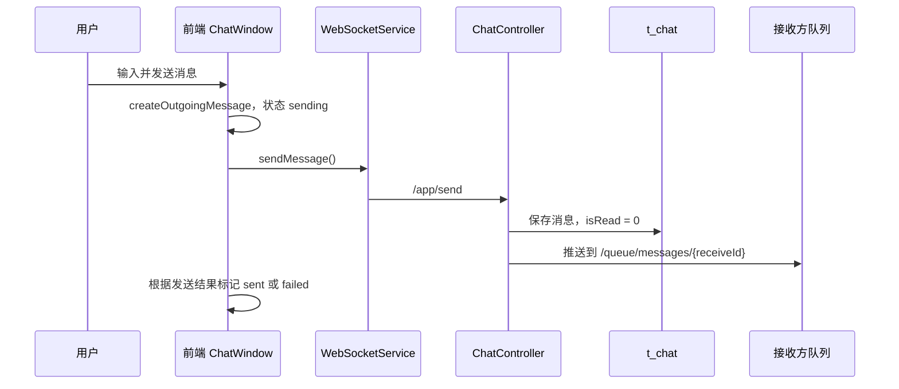
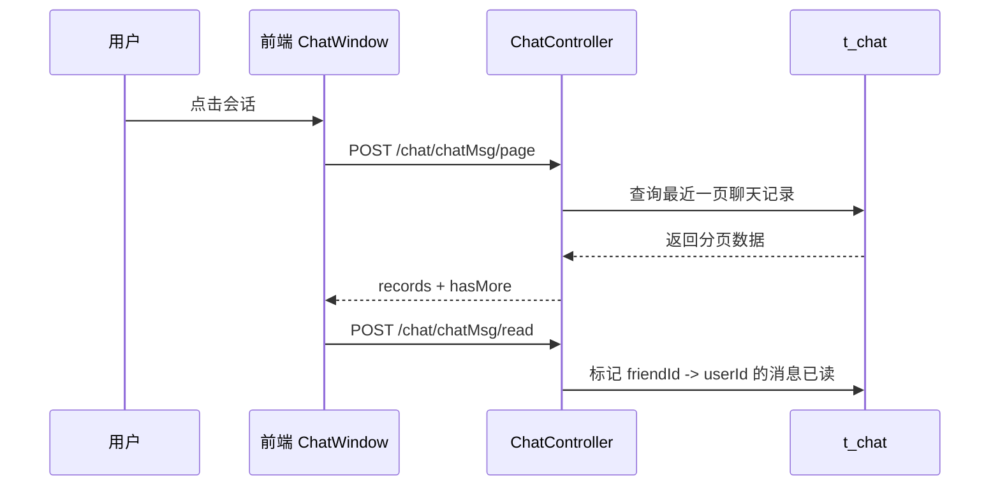
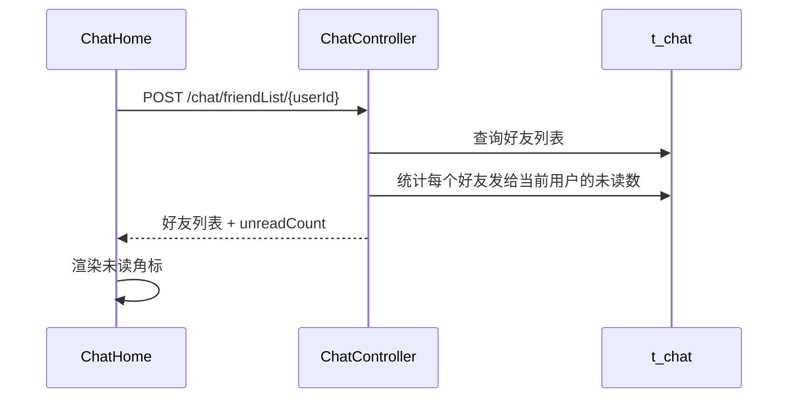

# 聊天室升级成果与后续开发路线

## 1. 背景与目标

本轮聊天室升级从“基础可用”推进到“更像一个真实聊天产品”。升级前，聊天室已经具备基础聊天、表情、图片、文件发送能力，但整体存在几个明显问题：

- 界面模块拼接感较强，缺少统一的产品视觉语言。
- 表情、输入区、消息区、会话列表的空间关系不够自然。
- 发送逻辑偏简单，缺少发送中、失败、重试等真实状态。
- 会话列表和聊天窗口之间缺少联动，最后消息、未读、排序都不完整。
- 历史消息一次性加载，不适合真实聊天记录增长后的场景。
- 后端已有 `isRead` 字段，但未读状态没有真正持久化使用。

本轮目标不是一次性做成完整 IM 系统，而是把现有聊天室沿着真实产品方向做一组低风险、可验证、可继续扩展的升级。

## 2. 已完成成果

### 2.1 界面产品化升级

已完成内容：

- 统一聊天室整体为低亮度暗色风格，减少突兀高亮色。
- 重构聊天页外层容器，让左侧会话和右侧聊天区更像一个完整应用。
- 优化会话列表卡片、头像、文件卡片、顶部栏、输入栏、消息气泡、表情弹层。
- 表情弹层从“凑上去”改为暗色 Popover 风格，与输入区视觉关联更自然。
- 空状态从简单占位变成有明确情绪和产品感的“选择一段对话”状态。

主要涉及文件：

- `shoka-blog/src/views/Chat/index.vue`
- `shoka-blog/src/components/ChatHome/index.vue`
- `shoka-blog/src/components/ChatHome/ChatWindow.vue`
- `shoka-blog/src/components/Emoji/index.vue`
- `shoka-blog/src/components/ChatHome/Chat/PersonCard.vue`
- `shoka-blog/src/components/ChatHome/Chat/Nav.vue`
- `shoka-blog/src/components/ChatHome/Chat/HeadPortrait.vue`
- `shoka-blog/src/components/ChatHome/Chat/FileCard.vue`

相关提交：

```text
d27a099 优化聊天室界面与会话体验
```

### 2.2 消息发送体验升级

已完成内容：

- 发送文本时增加空消息拦截。
- 对文本内容进行 HTML 转义，降低直接渲染 `v-html` 带来的风险。
- 表情文本仍会渲染为图片，但普通 HTML 会被转义为安全文本。
- 发送消息增加 `sending / sent / failed` 客户端状态。
- WebSocket 未连接或发送失败时，消息进入失败状态。
- 失败消息支持点击“重发”。
- 顶部显示连接状态：`在线 / 离线`。
- 视频和语音按钮改成明确的“接入中”提示，避免调用不存在的方法导致运行错误。

主要涉及文件：

- `shoka-blog/src/api/chat/config.ts`
- `shoka-blog/src/api/chat/type.ts`
- `shoka-blog/src/components/ChatHome/ChatWindow.vue`
- `shoka-blog/src/components/ChatHome/chatModel.ts`
- `shoka-blog/src/components/ChatHome/chatModel.test.mjs`

关键实现点：

- `sendMessage()` 从无返回改为返回 `boolean`，用于前端判断是否发送成功。
- 新增 `createOutgoingMessage()` 创建本地消息。
- 新增 `renderEmojiContent()` 处理表情渲染和 HTML 转义。
- 新增 `getMessagePreview()` 统一生成会话列表预览文案。

### 2.3 会话列表联动升级

已完成内容：

- 发送消息后，会话列表自动更新最后一条消息。
- 收到消息后，会话列表自动更新最后一条消息。
- 会话有新消息时自动置顶。
- 会话卡片显示最后消息、最后时间、发送失败提示。
- 图片消息预览为 `[图片]`。
- 文件消息预览为 `[文件] 文件名`。
- 文本消息预览会去掉表情图片标签和 HTML 标签，避免卡片里出现原始 HTML。

主要涉及文件：

- `shoka-blog/src/components/ChatHome/index.vue`
- `shoka-blog/src/components/ChatHome/ChatWindow.vue`
- `shoka-blog/src/components/ChatHome/Chat/PersonCard.vue`
- `shoka-blog/src/components/ChatHome/chatModel.ts`

关键实现点：

- `ChatWindow.vue` 通过 `conversationUpdate` 事件通知父组件。
- `ChatHome/index.vue` 使用 `updateConversationState()` 更新会话列表。
- `PersonCard.vue` 负责展示最后消息、时间和失败状态。

### 2.4 会话搜索与本地未读提示

已完成内容：

- 左侧会话列表增加搜索框。
- 支持按昵称、简介、最后消息搜索。
- 搜索无结果时显示暗色空状态。
- 非当前会话收到消息时，会话未读数增加。
- 点击会话后，本地未读数清空。

主要涉及文件：

- `shoka-blog/src/components/ChatHome/index.vue`
- `shoka-blog/src/components/ChatHome/Chat/PersonCard.vue`
- `shoka-blog/src/components/ChatHome/chatModel.ts`
- `shoka-blog/src/components/ChatHome/chatModel.test.mjs`

关键实现点：

- `filterConversations()` 负责会话搜索。
- `updateConversationState()` 负责未读数累加、最后消息更新、会话置顶。

### 2.5 历史消息分页加载

已完成内容：

- 后端新增聊天记录分页接口。
- 前端打开会话时只加载最近一页消息，不再一次性拉取全部历史。
- 聊天窗口顶部新增“加载更早消息”。
- 加载更早消息后，保持滚动位置，不让页面突然跳到底部。
- 合并历史消息时跳过重复消息，并按时间正序展示。

后端新增接口：

```http
POST /chat/chatMsg/page
```

请求体：

```json
{
  "senderId": "1",
  "receiveId": "2",
  "pageNum": 1,
  "pageSize": 20
}
```

返回结构：

```json
{
  "records": [],
  "total": 42,
  "pageNum": 1,
  "pageSize": 20,
  "hasMore": true
}
```

主要涉及文件：

- `blog-springboot/src/main/java/com/ican/controller/ChatController.java`
- `blog-springboot/src/main/java/com/ican/model/dto/ChatPageDTO.java`
- `blog-springboot/src/main/java/com/ican/model/vo/ChatMessagePageVO.java`
- `blog-springboot/src/main/java/com/ican/mapper/ChatMapper.java`
- `blog-springboot/src/main/resources/mapper/ChatMapper.xml`
- `blog-springboot/src/main/java/com/ican/service/ChatService.java`
- `blog-springboot/src/main/java/com/ican/service/impl/ChatServiceImpl.java`
- `shoka-blog/src/api/chat/index.ts`
- `shoka-blog/src/api/chat/type.ts`
- `shoka-blog/src/components/ChatHome/ChatWindow.vue`

相关提交：

```text
c9de1c1 新增聊天记录分页加载
```

### 2.6 未读状态持久化

已完成内容：

- 后端发送新消息时写入 `isRead = 0`。
- 好友列表接口返回每个会话的数据库未读数。
- 前端进入会话后调用后端接口，将该好友发给当前用户的消息标记为已读。
- 当前会话打开时收到新消息，也会立即标记为已读。
- 刷新页面后，未读数可以从后端恢复，不再只是前端临时状态。

后端新增接口：

```http
POST /chat/chatMsg/read
```

请求体：

```json
{
  "userId": "1",
  "friendId": "2"
}
```

语义：

- `userId` 是当前登录用户。
- `friendId` 是当前打开的好友会话。
- 后端只会把 `friendId -> userId` 方向的未读消息标记为已读。

主要涉及文件：

- `blog-springboot/src/main/java/com/ican/controller/ChatController.java`
- `blog-springboot/src/main/java/com/ican/model/dto/ChatReadDTO.java`
- `blog-springboot/src/main/java/com/ican/model/vo/FriendshipVO.java`
- `blog-springboot/src/main/java/com/ican/mapper/ChatMapper.java`
- `blog-springboot/src/main/resources/mapper/ChatMapper.xml`
- `blog-springboot/src/main/java/com/ican/service/ChatService.java`
- `blog-springboot/src/main/java/com/ican/service/impl/ChatServiceImpl.java`
- `shoka-blog/src/api/chat/index.ts`
- `shoka-blog/src/api/chat/type.ts`
- `shoka-blog/src/components/ChatHome/ChatWindow.vue`

相关提交：

```text
e0bd3e6 持久化聊天未读状态
```

## 3. 如何升级的

### 3.1 前端升级方式

前端没有一次性重写，而是沿着现有 Vue 组件结构逐步收紧：

1. 保留原有页面入口 `src/views/Chat/index.vue`。
2. 保留原有 `ChatHome` 组件边界，拆分左侧会话和右侧聊天窗口责任。
3. 把消息相关的纯逻辑抽到 `chatModel.ts`，避免所有逻辑堆在 Vue 文件里。
4. 对 `chatModel.ts` 写 Node 断言测试，覆盖消息预览、搜索、未读、分页合并等逻辑。
5. UI 继续使用现有技术栈和图标体系，没有引入新的大型 UI 框架。

前端新增或强化的核心模型：

- `ChatMessage`
- `ChatMessagePageRequest`
- `ChatMessagePage`
- `ChatReadRequest`
- `ConversationModel`
- `ConversationUpdatePayload`

前端新增核心纯函数：

- `createOutgoingMessage()`
- `renderEmojiContent()`
- `getMessagePreview()`
- `filterConversations()`
- `updateConversationState()`
- `mergeOlderMessages()`
- `formatFileSize()`
- `getFileTypeByMime()`
- `shouldCompressUpload()`

### 3.2 后端升级方式

后端沿用现有 Spring Boot + MyBatis Plus + STOMP 结构，没有推翻原有聊天链路：

1. WebSocket 发送仍走 `/app/send`。
2. 单聊推送仍走 `/queue/messages/{receiveId}`。
3. 文件上传仍走 `/chat/upload`。
4. 原有全量聊天记录接口 `/chat/chatMsg` 保留，避免破坏旧调用。
5. 新增分页接口 `/chat/chatMsg/page`，供新版前端使用。
6. 新增已读接口 `/chat/chatMsg/read`，补齐未读闭环。
7. 使用现有 `t_chat.is_read` 字段，不额外新增表结构。

后端新增或强化的核心对象：

- `ChatPageDTO`
- `ChatMessagePageVO`
- `ChatReadDTO`
- `FriendshipVO.unreadCount`

后端新增 Mapper 能力：

- `selectPageByCouple()`
- `countByCouple()`
- `countUnreadByCouple()`
- `markReadByCouple()`

## 4. 当前聊天链路

### 4.1 发送消息



### 4.2 打开会话



### 4.3 会话列表未读



## 5. 验证方式

前端逻辑测试：

```powershell
node src\components\ChatHome\chatModel.test.mjs
```

前端生产构建：

```powershell
npm run build
```

后端聊天 Service 单测：

```powershell
$env:JAVA_HOME='D:\IntelliJ IDEA 2025.2.4\jbr'
$env:Path="$env:JAVA_HOME\bin;$env:Path"
& 'D:\IntelliJ IDEA 2025.2.4\plugins\maven\lib\maven3\bin\mvn.cmd' -Dtest=ChatServiceImplTest test
```

当前已验证通过：

- `chatModel.test.mjs`
- `npm run build`
- `ChatServiceImplTest`

已知非阻断 warning：

- Vite 构建中存在原项目已有 CSS nesting target warning。
- Vite 构建中存在 chunk 大小 warning。
- Maven 测试中存在 JDK 动态 agent warning 和部分旧 API warning。

这些 warning 当前不阻断聊天室功能，但后期做工程治理时可以统一处理。

## 6. 当前边界与注意事项

### 6.1 仍然不是完整 IM 系统

当前聊天室已经从基础功能推进到较完整的单聊体验，但还不是完整 IM 系统。它目前主要支持：

- 好友会话列表
- 单聊收发
- 文本、表情、图片、文件
- 发送失败重试
- 会话搜索
- 未读数
- 历史分页

尚未覆盖：

- 多端登录同步
- 已读回执推送
- 在线状态真实感知
- 消息撤回
- 消息删除
- 群聊
- 用户输入中状态
- 消息搜索
- 音视频通话

### 6.2 当前未读实现的语义

当前 `isRead` 是数据库里的消息级状态：

- 新消息保存为 `0`。
- 当前用户打开某个好友会话时，将该好友发给当前用户的未读消息改为 `1`。
- 未读数通过 `sender_id = friendId AND receiver_id = userId AND is_read = 0` 统计。

这适合当前单聊场景。后续如果支持多端、多成员、群聊，需要引入更细的已读模型，例如单独的 `message_read` 表。

### 6.3 当前分页实现的语义

分页接口为了让用户先看到最新消息，数据库按 `create_time DESC` 拉取，再在 Service 中反转成正序返回给前端。

这样前端展示仍保持从旧到新：

```text
更早消息
...
最新消息
```

后续如果消息量继续增大，建议从 offset 分页升级为基于游标的分页，例如用 `beforeMessageId` 或 `beforeCreateTime`。

## 7. 后续开发路线

### 7.1 第一阶段：补齐真实单聊体验

优先级最高，适合下一轮继续做。

1. 会话列表最后消息后端化

   目标：刷新后会话列表仍然能显示每个好友的最后消息、最后时间、消息类型。

   建议实现：

   - 后端好友列表聚合每个会话最后一条消息。
   - `FriendshipVO` 增加 `lastMsg`、`lastTime`、`lastMessageType`。
   - 前端初始化会话列表时直接使用后端返回值。

2. WebSocket 断线重连与状态恢复

   目标：连接断开后自动重连，避免用户不知道消息发不出去。

   建议实现：

   - `WebSocketService` 增加重连次数和重连间隔。
   - 前端展示“连接中 / 已离线 / 已恢复”。
   - 失败消息在连接恢复后允许批量重试。

3. 消息确认机制

   目标：避免前端过早把消息标记为 sent。

   建议实现：

   - 后端保存消息后返回或推送包含数据库 `messageId` 的确认消息。
   - 前端使用 `localId` 匹配确认结果。
   - 消息状态从 `sending` 改为 `sent` 时携带真实 `messageId`。

### 7.2 第二阶段：增强消息能力

适合在单聊基础稳定后做。

1. 消息搜索

   - 支持按关键词搜索当前会话历史。
   - 后端提供 `/chat/chatMsg/search`。
   - 前端展示搜索结果并定位到消息。

2. 图片预览和文件体验

   - 图片点击预览大图。
   - 文件增加下载按钮、文件大小、文件类型图标。
   - 文件上传增加进度和失败重试。

3. 消息操作菜单

   - 复制文本。
   - 删除本地消息。
   - 撤回消息。
   - 重新发送失败消息。

4. 时间分割线

   - 同一天内按间隔展示时间。
   - 跨天展示日期。
   - 避免每条消息都重复显示完整时间。

### 7.3 第三阶段：在线状态与实时感

适合在 WebSocket 稳定后做。

1. 好友在线状态

   - 后端维护 WebSocket session 和用户在线映射。
   - 好友列表展示在线/离线。
   - 顶部状态从当前的连接状态升级为好友真实在线状态。

2. 输入中状态

   - 用户输入时通过 WebSocket 发送 typing 事件。
   - 对方窗口顶部显示“正在输入...”。
   - 做节流，避免每次键盘输入都发消息。

3. 已读回执

   - 当前实现只做“未读数持久化”。
   - 后续可以把已读状态通过 WebSocket 推给发送方。
   - 发送方消息下方显示“已读 / 未读”。

### 7.4 第四阶段：结构升级

适合聊天室功能继续增多时做。

1. 数据结构调整

   当前 `t_chat` 可以支撑简单单聊，但后续建议拆成：

   - `chat_conversation`：会话表
   - `chat_message`：消息表
   - `chat_message_read`：成员已读表
   - `chat_conversation_member`：会话成员表

2. 支持群聊

   群聊不建议直接复用当前 `sender_id / receiver_id` 双人模型硬扩展。更合理的是先引入会话模型，再让单聊和群聊都归属于 conversation。

3. 多端同步

   - 同一用户多个设备同时在线。
   - 消息发送、已读、删除、撤回都需要同步到该用户所有在线端。

4. 消息投递可靠性

   - 消息 ACK。
   - 离线消息同步。
   - 本地临时消息和数据库消息合并。
   - 幂等发送，避免重试产生重复消息。

## 8. 建议的下一轮任务

如果后续继续开发，建议下一轮优先做：

```text
会话列表最后消息后端化
```

原因：

- 这是当前产品体验最明显的剩余缺口。
- 它和已完成的分页、未读持久化在同一条数据链路上。
- 做完后，刷新页面也能恢复真实会话列表状态。
- 后续做消息搜索、离线同步、会话排序都会更顺。

建议验收标准：

- 好友列表接口返回每个会话的最后消息。
- 好友列表接口返回每个会话的最后消息时间。
- 图片、文件、文本都有正确预览。
- 刷新页面后，会话列表顺序、未读数、最后消息仍然正确。
- 有后端单测覆盖最后消息聚合逻辑。
- 前端构建通过。

## 9. 提交记录

本轮聊天室相关提交记录：

```text
e0bd3e6 持久化聊天未读状态
c9de1c1 新增聊天记录分页加载
d27a099 优化聊天室界面与会话体验
```

这些提交都在分支：

```text
codex/chathome-upgrade
```

